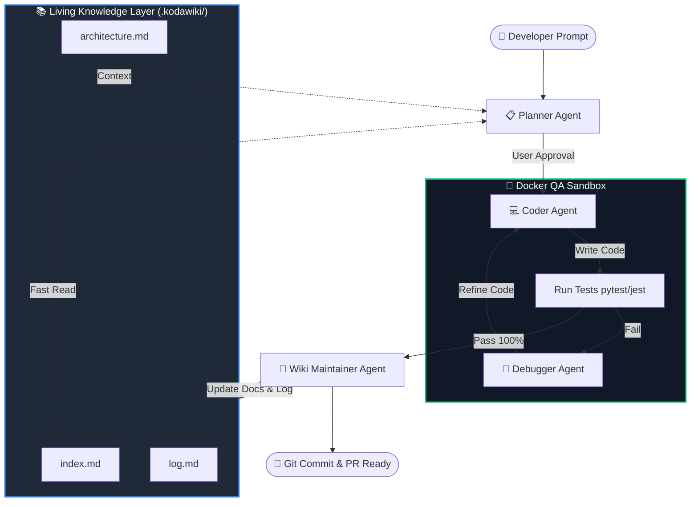

<div align="center">

# 🧠 KodaWiki (Kodā-Wiki)

### *Autonomous Software Engineer & Living Codebase Knowledge Agent*

[](https://www.python.org/)
[](https://github.com/langchain-ai/langgraph)
[](https://www.docker.com/)
[](https://fastapi.tiangolo.com/)
[](https://nextjs.org/)
[](https://opensource.org/licenses/MIT)

<p align="center">
  <b>KodaWiki</b> bridges the gap between <b>Autonomous Software Engineering (Devin / SWE-agent)</b> and <b>Living Codebase Documentation</b> based on <a href="https://gist.github.com/karpathy/442a6bf555914893e9891c11519de94f">Andrej Karpathy's LLM Wiki paradigm</a>.
</p>

[Key Features](#-key-features) • [Architecture](#-system-architecture) • [Comparison](#-why-kodawiki-vs-traditional-rag) • [Quick Start](#-quick-start) • [Roadmap](#-roadmap)

---

</div>

## 💡 The Core Vision

Most AI coding tools rely on **Stateless RAG** or blindly dumping files into context windows. As codebases grow, AI gets lost, token costs explode, and project documentation rapidly becomes stale.

**KodaWiki solves this with a 2-Way Synergy:**
1. **Wiki-Assisted Coding**: Before writing code, KodaWiki queries a self-compounding `.kodawiki/` knowledge base to understand architecture in seconds without reading thousands of raw code lines.
2. **Self-Updating Documentation**: Once code is written and tests pass in a Docker sandbox, KodaWiki inspects `git diff` and automatically updates the project's living `.kodawiki/*.md` documentation and `log.md`.

> *"The wiki is a persistent, compounding artifact. The LLM writes and maintains all of it."* — **Andrej Karpathy**

---

## ⚡ Key Features

- 🤖 **Multi-Agent State Machine**: Built on **LangGraph**, orchestrating specialized Planner, Coder, Tester, Debugger, and Wiki-Maintainer agents.
- 🐳 **Isolated Docker Sandbox**: Runs unit tests (`pytest`, `jest`) safely in containerized environments with real-time `stdout/stderr` streaming.
- 🔁 **Self-Correction QA Loop**: If tests fail, the Debugger Agent analyzes stack traces and guides the Coder Agent to fix issues until tests pass 100%.
- 📚 **Karpathy LLM Wiki Architecture**: Automatically maintains `.kodawiki/index.md`, `.kodawiki/log.md`, and modular concept pages.
- 👤 **Human-in-the-Loop**: Interactive UI allowing developers to approve or edit feature execution plans before code is modified.
- 🔌 **Multi-LLM Support**: Powered by Claude 3.5 Sonnet / GPT-4o, with full local support for **Ollama (DeepSeek-Coder / Qwen 2.5 Coder)**.

---

## 🏗️ System Architecture



---

## 📊 Why KodaWiki vs Traditional RAG?

| Feature | Traditional RAG / Chatbots | KodaWiki (LLM Wiki + Agent) |
| :--- | :--- | :--- |
| **Context Strategy** | Rediscovers facts from scratch on every query | Uses persistent, pre-compiled `.kodawiki/` pages |
| **Speed & Token Cost** | Slow, expensive (chunks entire codebase) | Fast, cheap (queries indexed wiki summaries) |
| **Code Verification** | Generates untested code snippets | Runs tests in isolated **Docker Sandbox** until green |
| **Documentation** | Manually written (gets outdated fast) | **Self-updating Living Documentation** |
| **Error Fixes** | Human must copy-paste errors back to LLM | **Autonomous Debugger Loop** fixes until `pytest` passes |

---

## 🗂️ Karpathy's 3-Layer Structure in KodaWiki

1. **Raw Sources (Immutable)**: Your actual project codebase (`.py`, `.ts`, `schema.sql`, tests).
2. **The Wiki (`.kodawiki/`)**: AI-generated and maintained Markdown files:
   - `index.md`: Master catalog of all modules, APIs, and schemas.
   - `log.md`: Chronological log of agent actions (e.g. `[2026-09-21] Added OAuth API -> Updated auth.md`).
   - `modules/`: Component-specific architectural documentation.
3. **The Schema (`AGENTS.md`)**: Instructions guiding the Multi-Agent system on coding conventions and wiki maintenance rules.

---

## 🛠️ Tech Stack

- **Agent Core**: Python 3.11+, LangGraph, LangChain, Pydantic v2
- **Sandbox Environment**: Docker Python SDK, Subprocess Isolation
- **Backend API**: FastAPI, WebSockets (for live terminal streaming)
- **Frontend Dashboard**: Next.js 14, React, TailwindCSS, Monaco Code Editor, Lucide Icons
- **Supported Models**: Anthropic Claude 3.5 Sonnet, OpenAI GPT-4o, Ollama (DeepSeek-Coder)

---

## 🚀 Quick Start

### Prerequisites

- Python 3.11+
- Docker Desktop (running)
- Node.js 18+ (for frontend dashboard)

### 1. Clone & Install Dependencies

```bash
git clone https://github.com/dothanhtuan1704-droid/KodaWiki.git
cd KodaWiki

# Create virtual environment
python -m venv venv
# On Windows:
.\venv\Scripts\activate
# On Linux/macOS:
# source venv/bin/activate

pip install -r requirements.txt
```

### 2. Environment Configuration

Create a `.env` file in the root directory:

```env
OPENAI_API_KEY=your_openai_api_key_here
ANTHROPIC_API_KEY=your_anthropic_api_key_here
LLM_PROVIDER=claude-3-5-sonnet # or gpt-4o / ollama
OLLAMA_BASE_URL=http://localhost:11434
DOCKER_SANDBOX_IMAGE=python:3.11-slim
```

### 3. Initialize KodaWiki on a Project

```bash
# Initialize KodaWiki on your target codebase
python -m kodawiki.cli init --target-dir ./my-project-repo
```

### 4. Run KodaWiki Server & UI

```bash
# Start FastAPI backend
python -m kodawiki.server

# In another terminal, start Next.js UI
cd frontend
npm install
npm run dev
```

Open `http://localhost:3000` in your browser to access the KodaWiki Dashboard!

---

## 🗺️ Roadmap

- [x] Initial Architecture & Specification Proposal
- [ ] Core LangGraph State Machine (Planner -> Coder -> Tester -> Debugger)
- [ ] Docker Container Sandbox Manager with Python API
- [ ] Karpathy LLM Wiki Ingest & Maintenance Engine
- [ ] Next.js Interactive Dashboard with Live Terminal & Side-by-Side Git Diff
- [ ] Human-in-the-Loop Plan Approval Modal
- [ ] One-click GitHub PR creation integration

---

## 🤝 Contributing

Contributions, issues, and feature requests are welcome! Feel free to check the [issues page](https://github.com/dothanhtuan1704-droid/KodaWiki/issues).

---

## 📄 License & Acknowledgments

This project is licensed under the **MIT License**.

### Special Thanks:
- **Andrej Karpathy** for the groundbreaking [LLM Wiki Paradigm](https://gist.github.com/karpathy/442a6bf555914893e9891c11519de94f).
- **Cognition AI (Devin)** & **Princeton (SWE-agent)** for pioneering autonomous software engineering agents.
- **LangChain / LangGraph Team** for the multi-agent state graph framework.

<div align="center">
  <sub>Built with ❤️ by <a href="https://github.com/dothanhtuan1704-droid">Do Thanh Tuan</a></sub>
</div>
